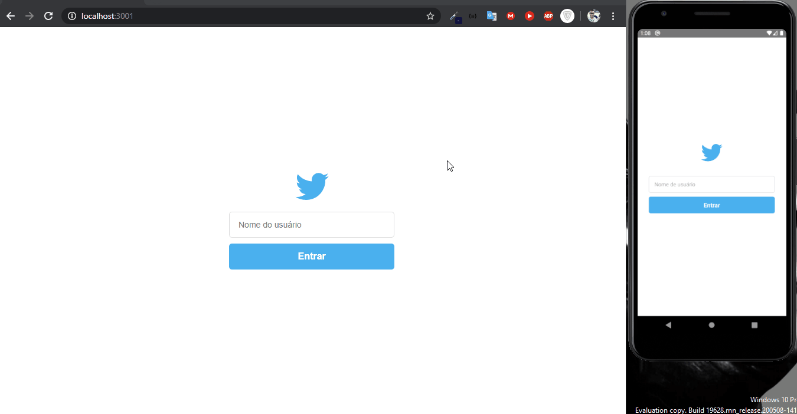

[](https://github.com/dyhalmeida)
[](#)

<h3 align="center">Tweet is an application that allows you to post tweets and likes in real time</h3>

<div align="center" >
  
</div>

## 📑 Technologies and modules used

This project was developed with the following technologies:

- ✔️ [ReactJS](https://pt-br.reactjs.org/)
- ✔️ [React Native](https://reactnative.dev/)
- ✔️ [NodeJS](https://nodejs.org/en/)
- ✔️ [ExpressJS](http://expressjs.com/)

## 📍 Features
- ✔️ Create a tweet message
- 📄 List all tweet messages
- 🧡 Like in a tweet message

<br/>

## 🚀 Getting Started

### 💻 Clone the repository
```bash
git clone https://github.com/dyhalmeida/tweet-omnistack-5.git
```
<br/>

### 💻 Start Tweet API
```bash
# go to backend folder and visit the link below for the other step-by-step instructions
```
- [Tweet API Documentation](https://github.com/dyhalmeida/tweet-omnistack-5/tree/master/backend#readme)

<br/>

### 💻 Start Tweet Web
```bash
# go to frontend folder and visit the link below for the other step-by-step instructions
```
- [Tweet Web Documentation](https://github.com/dyhalmeida/tweet-omnistack-5/tree/master/frontend#readme)

<br/>

### 💻 Start Tweet App
```bash
# go to mobile folder and visit the link below for the other step-by-step instructions
```
- [Tweet App Documentation](https://github.com/dyhalmeida/tweet-omnistack-5/tree/master/mobile#readme)

<br/>

## 🔓 License 
MIT © [Diego Almeida](https://www.linkedin.com/in/dyhalmeida/)